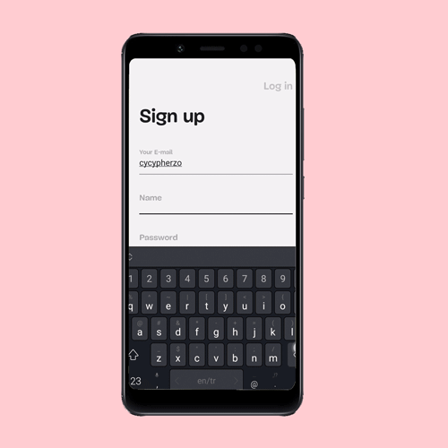

# ActivePam - Pamela Rief Workout Schedules App
 
ActivePam is workout schedules flutter app.
 
## Table of contents
* [Introduction](#Introduction)
* [Technologies](#Technologies)
* [Features](#Features)
* [Screenshots](#Screenshots)
* [Used Flutter Packeges](#Packages)
 
    
## Introduction
 
ActivePam includes easy access to weekly home workout plans created by fitness influencer Pamela Reif. With progress tracking and daily reminders option.
 
## Technologies
[Flutter]() .
 [Firebase]() .
-Firebase Authentication.
-Cloud Firestore.
 
## Features
* User authentication with Firebase (email and password + google sign in).
* Easy access to an organized weekly workout plan.
* Watch planned workout videos from YouTube.
* Track daily and weekly progress via user authentications.
* Send scheduled daily remainders.
 
## Screenshots

[log_in](https://github.com/CypherZox/ActivePam/blob/master/assets/Screenshots/log_in.gif)
[day_screen](https://github.com/CypherZox/ActivePam/blob/master/assets/Screenshots/day.gif)
[vido_screen](https://github.com/CypherZox/ActivePam/blob/master/assets/Screenshots/vid_screen_1.gif)
[transitoin_in_video_screen](https://github.com/CypherZox/ActivePam/blob/master/assets/Screenshots/vid_trans.gif)
[quitting_video_screen](https://github.com/CypherZox/ActivePam/blob/master/assets/Screenshots/quit_vid.gif)
[set_reminder](https://github.com/CypherZox/ActivePam/blob/master/assets/Screenshots/set_reminder.gif)
[log_out](https://github.com/CypherZox/ActivePam/blob/master/assets/Screenshots/log_out.gif)
 
 
## Used Flutter Packeges
* [youtube_player_flutter 7.0.0+7](https://pub.dev/packages/youtube_player_flutter)
* [firebase_auth: ^0.20.0](https://pub.dev/packages/firebase_auth)
* [firebase_core: ^0.7.0](https://pub.dev/packages/firebase_core)
* [cloud_firestore: ^0.16.0](https://pub.dev/packages/cloud_firestore)
* [flutter_local_notifications: ^3.0.3](https://pub.dev/packages/flutter_local_notifications)
 
 
## Potential updates 
* Add calendar reminders.
* Visualization of usage analysis(Calendar + Frequency + Streaks + History)
 
## Inspiration 
Facing the problem of searching every single video from the weekly plans pictures manually, and having to remember all the videos before starting my workout.
With this app, I can access all the videos more conveniently.
 
## code sources
* The animation in the day screen was from FireShip's [tutorial](https://fireship.io/lessons/flutter-slider-like-reflectly/).
 

