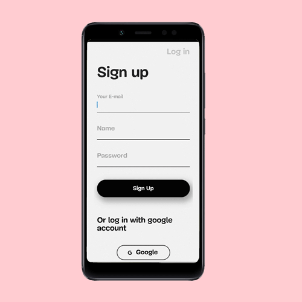
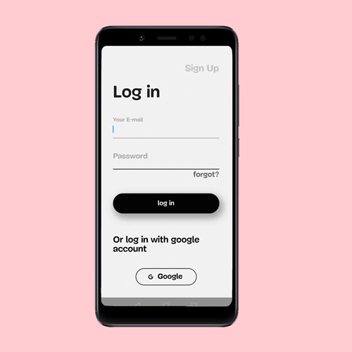
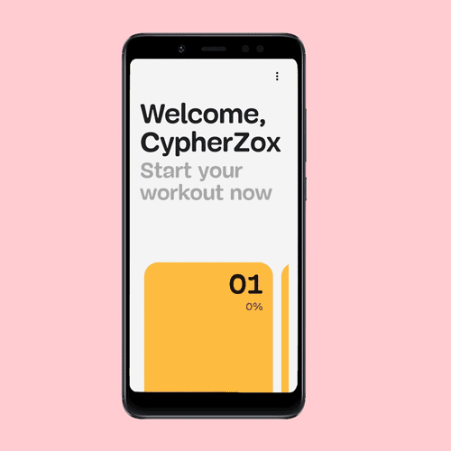
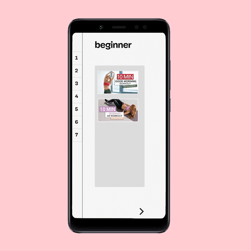
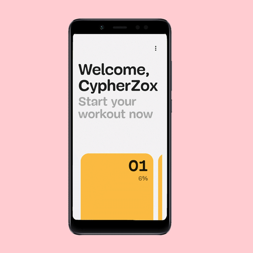
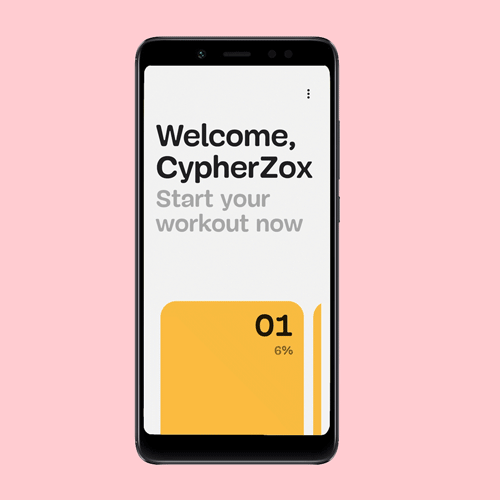
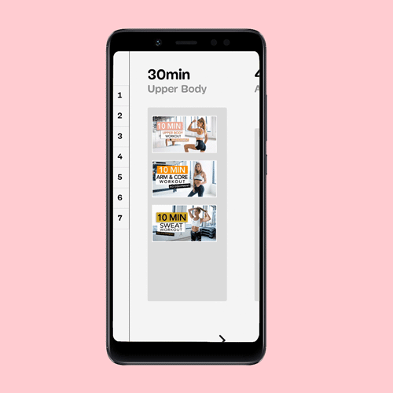

# ActivePam - Pamela Rief Workout Schedules App
 
ActivePam is a workout app that features weekly home workout plans.
 
## Table of contents
* [Introduction](#Introduction)
* [Technologies](#Technologies)
* [Features](#Features)
* [Screenshots](#Screenshots)
* [Used Flutter Packeges](#Packages)
 
    
## Introduction
 
ActivePam includes easy access to weekly home workout plans created by fitness influencer Pamela Reif. With progress tracking and daily reminders option.
 
## Technologies
 HEAD
*  Flutter.
* Firebase.  

*   Flutter.
*   Firebase.  

-Firebase Authentication.  
-Cloud Firestore(For Storage).  
 
## Features
* User authentication with Firebase (email and password + google sign in).
* Easy access to an organized weekly workout plan.
* Watch planned workout videos from YouTube.
* Track daily and weekly progress via user authentications.
* Send scheduled daily remainders.
 
## Screenshots
* Sign Up  
Users can sign up with eighther email and password or a google account.
Code handles errors if email is already used for another existing account.  Developed using firebase authentication services. 
[code](https://github.com/CypherZox/ActivePam/blob/master/lib/screens/register.dart)  

* Log in  
Log in code can handle errors if the password is wrong, or user is facing connection problems, user also has password reset option. all done using firebase authentication.  
[code](https://github.com/CypherZox/ActivePam/blob/master/lib/screens/log_in.dart)  

* Day Screen  
Day screen is a screen that shows the daily workouts consisting of different versions of plans(30 minutes, 45 minutes, or beginner workout). Users can transition between the different versions with smooth animation transitions.
* Used cloude firestore to store YouTube video IDs, for showing the videos thumbnails also to pass them into the video screen.  
[code](https://github.com/CypherZox/ActivePam/blob/master/lib/screens/DayScreen.dart)  

* Video Screen  
Video screen uses [Youtube_player_package](https://pub.dev/packages/youtube_player_flutter), first the Youtube videos IDs are retrieved from the cloud firestore and then passed them in a list.  
[code](https://github.com/CypherZox/ActivePam/blob/master/lib/screens/vid_screen.dart)  

* Next Video  
User can skip one video and move on to the next one with one click  

* Exiting Video Screen  

* Set Reminder option  
Users have the choice to set scheduled daily reminders as notifications.
Developed this feature with the help of [flutter_local_notifications: ^3.0.3](https://pub.dev/packages/flutter_local_notifications) .  

* Log out   

* Weekly Progress indicator(percentage)  
The app uses a function that counts how much of progress the user has made in one day and store that progress as a percentage in Cloud FireStore. using this [code](https://github.com/CypherZox/ActivePam/blob/master/lib/data/percentage_logic.dart)   
With the use of another function weekly progress is also indicated and shown to the user in the [week_tile](https://github.com/CypherZox/ActivePam/blob/master/lib/widgets/weektile2.dart) 

 
## Used Flutter Packeges
* [youtube_player_flutter 7.0.0+7](https://pub.dev/packages/youtube_player_flutter)
* [firebase_auth: ^0.20.0](https://pub.dev/packages/firebase_auth)
* [firebase_core: ^0.7.0](https://pub.dev/packages/firebase_core)
* [cloud_firestore: ^0.16.0](https://pub.dev/packages/cloud_firestore)
* [flutter_local_notifications: ^3.0.3](https://pub.dev/packages/flutter_local_notifications)
 
 
## Potential updates 
* Add calendar reminders.
* Visualization of usage analysis(Calendar + Frequency + Streaks + History)
 
## Inspiration 
Facing the problem of searching every single video from the weekly plans pictures manually, also having to remember all the videos before starting my workout.
With this app, I can access all the videos more conveniently.
Pamela Rief install: @pamela_rf
 
## code sources
* The animation in the day screen was from FireShip's [tutorial](https://fireship.io/lessons/flutter-slider-like-reflectly/).
 

